# AMBA APB UART (8-E-1) Core - Design & Verification

An optimized, synthesizable polled-mode UART IP core modeled after **TI KeyStone UART specifications** (8-E-1 fixed format, no interrupts) and interfaced via **AMBA APB3**. Tested using a SystemVerilog OOP environment, assertions (SVA), and functional coverage.

---

## 1. Overview
The **AMBA APB UART Core** is a custom hardware block designed to bridge high-speed parallel system buses to low-speed serial peripherals. It implements a complete polled-mode UART (Universal Asynchronous Receiver-Transmitter) protocol wrapped inside an AMBA APB3 completer interface.

Key features include:
*   **Bus Compatibility**: Full compliance with the AMBA APB3 specifications, supporting zero-wait-state transfers.
*   **UART Specifications**: Fixed 8-E-1 data framing (8 data bits, Even parity, 1 stop bit) to simplify physical interfaces, with a robust 16x oversampling mid-bit sampler for reliable noise-immune data recovery.
*   **Buffering**: Parameterized First-Word Fall-Through (FWFT) synchronous FIFOs (16-byte deep) for both transmission (TX) and reception (RX). The RX FIFO stores line error statuses directly alongside data bytes to maintain strict error tracking.
*   **Clock Management**: Fully integrated fractional baud rate divider using a 16-bit divisor.
*   **Verification Suite**: Dual-tier verification environment containing a lightweight direct loopback simulation using Icarus Verilog, and a complete SystemVerilog OOP-based Testbench with functional coverage, SystemVerilog Assertions (SVA), and constrained-random stimulus generator.

---

## 2. UART Explanation & Specifications
### Operational Specifications
*   **Fixed Frame Format**: 11-bit frame including:
    *   **1 Start Bit** (logic low)
    *   **8 Data Bits** (transmitted Least Significant Bit (LSB) first)
    *   **1 Even Parity Bit** (even parity calculated over the 8 data bits)
    *   **1 Stop Bit** (logic high)
    
    $$\text{Frame} = 1\text{ Start bit} + 8\text{ Data bits} + 1\text{ Even Parity bit} + 1\text{ Stop bit}$$
*   **Baud Rate Clocking**: The internal `baud_rate_generator` divides the main system clock (`PCLK`) based on a 16-bit divisor register:
    $$Divisor = \{DLH, DLL\}$$
    This divider generates the 16x oversampling clock enable pulse (`bclk_en`).
*   **Mid-Bit Sampling**:
    *   The receiver checks for a valid start bit by detecting a falling edge and sampling at the **8th tick** of the 16x oversampling clock. If the line is high at the 8th tick, it is rejected as a glitch.
    *   Subsequent data, parity, and stop bits are sampled at their center point (the **8th tick** of each 16-tick window) to maximize signal integrity and minimize phase noise influence.

### Block Diagram of the Simplified UART Core
We have implemented a streamlined version of the standard 16550 UART design, omitting interrupt controllers and flow control, and hardcoding the data format to 8-E-1. The functional architecture is diagrammed below:

```mermaid
graph TD
    %% Styling
    classDef bus fill:#eef,stroke:#33f,stroke-width:2px;
    classDef core fill:#ffe,stroke:#b80,stroke-width:2px;
    classDef serial fill:#fee,stroke:#f33,stroke-width:2px;
    classDef fifo fill:#efe,stroke:#3a3,stroke-width:2px;

    %% AMBA APB Bus Interface
    subgraph APB_Interface ["AMBA APB3 Slave Interface"]
        PCLK["PCLK (Clock)"]
        PRESETn["PRESETn (Reset)"]
        PADDR["PADDR [4:0]"]
        PSEL["PSEL"]
        PENABLE["PENABLE"]
        PWRITE["PWRITE"]
        PWDATA["PWDATA [31:0]"]
        PRDATA["PRDATA [31:0]"]
        PREADY["PREADY (tied 1)"]
        PSLVERR["PSLVERR (tied 0)"]
    end

    %% Internal Register & Control Block
    subgraph RegBlock ["Register Block & Control Logic (uart_regs.sv)"]
        RegDec["Register Decoder"]
        LCR["LCR (Line Control Register)"]
        LSR["LSR (Line Status Register)"]
        FCR["FCR (FIFO Control Register)"]
        SCR["SCR (Scratchpad Register)"]
        DLL["DLL (Divisor Latch LSB)"]
        DLH["DLH (Divisor Latch MSB)"]
    end

    %% Baud Rate Generator
    subgraph BRG ["Baud Rate Generator (baud_rate_generator.sv)"]
        Divisor["Divisor [15:0]"]
        Counter["16-bit Counter"]
        bclk_en["bclk_en (16x Clock Enable Tick)"]
        bclk["bclk (50% Duty Cycle Clock)"]
    end

    %% FIFOs
    subgraph FIFOs ["Buffer FIFOs"]
        TX_FIFO["TX FIFO (16x8 FWFT)"]
        RX_FIFO["RX FIFO (16x11 FWFT)"]
    end

    %% UART Serial Engines
    subgraph Engines ["UART Serial Engines"]
        UART_TX["UART Transmitter (uart_tx.sv)"]
        UART_RX["UART Receiver (uart_rx.sv)"]
    end

    %% Connections
    PADDR & PSEL & PENABLE & PWRITE & PWDATA --> RegDec
    RegDec --> LCR & FCR & SCR & DLL & DLH
    DLL & DLH --> Divisor
    Divisor --> BRG
    PCLK & PRESETn --> BRG & RegBlock & UART_TX & UART_RX
    
    %% TX path
    PWDATA[7:0] -- "CPU Write" --> TX_FIFO
    TX_FIFO -- "tx_data [7:0] & tx_start" --> UART_TX
    UART_TX --> TXD["TXD (Transmit Pin)"]
    UART_TX -- "tx_busy & tx_done" --> RegBlock
    
    %% RX path
    RXD["RXD (Receive Pin)"] --> UART_RX
    UART_RX -- "rx_data [7:0] & rx_valid" --> RX_FIFO
    UART_RX -- "PE, FE, BI errors" --> RX_FIFO
    RX_FIFO -- "rdata & errors" --> RegDec
    RegDec --> PRDATA
    
    %% Clock enables
    bclk_en --> UART_TX
    bclk_en --> UART_RX

    %% Apply Classes
    class PCLK,PRESETn,PADDR,PSEL,PENABLE,PWRITE,PWDATA,PRDATA,PREADY,PSLVERR bus;
    class LCR,LSR,FCR,SCR,DLL,DLH,RegDec core;
    class UART_TX,UART_RX,BRG core;
    class TX_FIFO,RX_FIFO fifo;
    class TXD,RXD serial;
```



### Reference Diagrams (TI KeyStone Spec Reference)

*   **16x Oversampling / Mid-bit Sampling Timing**
    The receiver FSM transitions on the falling edge of `RXD`, waits 8 cycles of `bclk_en` to hit the middle of the START bit, and then samples data bits every 16 cycles thereafter.
    
    

*   **UART Serial Frame Format (8-bit Even Parity Frame Format Option)**
    Our implementation locks registers and engines to the 8-bit word, even parity, 1 stop bit configuration.
    
    

---

## 3. APB Explanation & Specifications
### Operational Specifications
The UART core behaves as an **AMBA APB3 Completer (Slave)**.
*   **Port Interface**:
    *   `PCLK`, `PRESETn`: System clock and active-low async reset.
    *   `PADDR[4:0]`: Address bus.
    *   `PSEL`, `PENABLE`: APB select and strobe signals.
    *   `PWRITE`: Write (`1`) or Read (`0`) direction signal.
    *   `PWDATA[31:0]`: Write data bus (lower 8 bits active).
    *   `PRDATA[31:0]`: Read data bus (zero-padded to 32-bit).
    *   `PREADY`: Ready flag, tied to `1'b1` indicating zero-wait-state transfers.
    *   `PSLVERR`: Slave error flag, tied to `1'b0` (never errors out).
*   **Two-Cycle Bus Transactions**:
    1.  **SETUP Phase**: Asserts `PSEL` high while `PENABLE` remains low. The address `PADDR` and control signals are driven stable.
    2.  **ACCESS Phase**: Asserts `PENABLE` high. The completer captures the write data on `PWDATA` (for writes) or drives read data on `PRDATA` (for reads). Due to `PREADY` being tied high, the transfer completes at the next rising edge of `PCLK`.

### State Diagram & Timing waveforms (AMBA APB Spec Reference)

*   **APB Operating States FSM State Diagram**
    The core supports standard state-transitions (IDLE -> SETUP -> ACCESS).
    
    

*   **Write Transfer (No Wait States)**
    Address, control signals, and write data remain stable across setup and access cycles.
    
    

*   **Read Transfer (No Wait States)**
    Read data `PRDATA` is driven by the slave during the access phase and sampled by the host at the rising edge.
    
    

---

## 4. Project Directory Structure
The repository contains the following files. Click on a filename to navigate directly to it:

| Component | File / Path | Description |
| :--- | :--- | :--- |
| **Top Wrapper** | [apb_uart.sv](file:///e:/projects/VLSI-Projects/UART-Design&Verification/rtl/apb_uart.sv) | Core wrapper integrating the APB bus, register file, and UART TX/RX engines. |
| **RTL Design** | [uart_regs.sv](file:///e:/projects/VLSI-Projects/UART-Design&Verification/rtl/uart_regs.sv) | Register file holding status (`LSR`), control (`LCR`, `FCR`, `SCR`), and baud settings (`DLL`, `DLH`), housing the dual FWFT buffers. |
| | [uart_tx.sv](file:///e:/projects/VLSI-Projects/UART-Design&Verification/rtl/uart_tx.sv) | Serial transmitter engine implementing fixed 8-E-1 serialization FSM. |
| | [uart_rx.sv](file:///e:/projects/VLSI-Projects/UART-Design&Verification/rtl/uart_rx.sv) | Serial receiver engine implementing mid-bit oversampling, synchronizers, and error checks. |
| | [fifo.sv](file:///e:/projects/VLSI-Projects/UART-Design&Verification/rtl/fifo.sv) | Parameterized First-Word Fall-Through (FWFT) synchronous FIFO buffer. |
| | [baud_rate_generator.sv](file:///e:/projects/VLSI-Projects/UART-Design&Verification/rtl/baud_rate_generator.sv) | Baud divider counting system clock cycles to produce the 16x baud clock tick. |
| **SystemVerilog OOP TB** | [tb_top.sv](file:///e:/projects/VLSI-Projects/UART-Design&Verification/tb_sv/tb_top.sv) | Top testbench instantiating DUT, interfaces, binding assertions, and executing simulation. |
| | [apb_interface.sv](file:///e:/projects/VLSI-Projects/UART-Design&Verification/tb_sv/apb_interface.sv) | APB3 bus physical interface mapping clocking blocks and APB protocol check assertions. |
| | [uart_interface.sv](file:///e:/projects/VLSI-Projects/UART-Design&Verification/tb_sv/uart_interface.sv) | Flat interface container for the TXD and RXD serial physical lines. |
| | [tb_pkg.sv](file:///e:/projects/VLSI-Projects/UART-Design&Verification/tb_sv/tb_pkg.sv) | Verification package clustering transaction structures, generator, driver, monitors, and scoreboard. |
| | [uart_config.sv](file:///e:/projects/VLSI-Projects/UART-Design&Verification/tb_sv/uart_config.sv) | Config database object containing randomized divisor and bit periods limits. |
| | [apb_trans.sv](file:///e:/projects/VLSI-Projects/UART-Design&Verification/tb_sv/apb_trans.sv) | Transaction item holding randomized address, data, and read/write directions. |
| | [generator.sv](file:///e:/projects/VLSI-Projects/UART-Design&Verification/tb_sv/generator.sv) | High-level sequence generator driving stimulus into the driver and timing wait-states. |
| | [driver.sv](file:///e:/projects/VLSI-Projects/UART-Design&Verification/tb_sv/driver.sv) | Driver translating TLM transaction packets to pin-level APB bus signals. |
| | [apb_monitor.sv](file:///e:/projects/VLSI-Projects/UART-Design&Verification/tb_sv/apb_monitor.sv) | Monitor sniffing the APB interface and converting pin transitions back to transaction structures. |
| | [uart_monitor.sv](file:///e:/projects/VLSI-Projects/UART-Design&Verification/tb_sv/uart_monitor.sv) | Monitor sampling serial lines to rebuild received bytes for comparison. |
| | [scoreboard.sv](file:///e:/projects/VLSI-Projects/UART-Design&Verification/tb_sv/scoreboard.sv) | Scoreboard comparing written versus readback/serialized data. |
| | [env_coverage.sv](file:///e:/projects/VLSI-Projects/UART-Design&Verification/tb_sv/env_coverage.sv) | Functional coverage module mapping LCR configurations (word sizes, stop bits, parity). |
| | [env.sv](file:///e:/projects/VLSI-Projects/UART-Design&Verification/tb_sv/env.sv) | Top-level verification environment container organizing initialization and run. |
| | [uart_tx_sva.sv](file:///e:/projects/VLSI-Projects/UART-Design&Verification/tb_sv/uart_tx_sva.sv) | Assertion block monitoring serial line timing and checking protocol violations. |
| **Lightweight Testbench** | [tb_apb_uart.sv](file:///e:/projects/VLSI-Projects/UART-Design&Verification/tb/tb_apb_uart.sv) | Lightweight direct loopback regression testbench optimized for quick runs via `iverilog`. |
| | [tb_baud_rate_generator.sv](file:///e:/projects/VLSI-Projects/UART-Design&Verification/tb/tb_baud_rate_generator.sv) | Standalone unit testbench verifying Baud Rate Generator divisor logic. |
| | [tb_fifo.sv](file:///e:/projects/VLSI-Projects/UART-Design&Verification/tb/tb_fifo.sv) | Standalone unit testbench testing FIFO clear, write, read, overflow/underflow behavior. |
| | [tb_uart_tx_rx.sv](file:///e:/projects/VLSI-Projects/UART-Design&Verification/tb/tb_uart_tx_rx.sv) | Regression simulation for independent TX and RX engine functional checking. |

---

## 5. How to Run Simulation
### A. Local Simulation (using Icarus Verilog)
To compile and simulate the lightweight loopback testbench locally, execute the following commands in your shell:
```bash
iverilog -g2012 -o apb_uart_tb.vvp rtl/baud_rate_generator.sv rtl/fifo.sv rtl/uart_tx.sv rtl/uart_rx.sv rtl/uart_regs.sv rtl/apb_uart.sv tb/tb_apb_uart.sv
vvp apb_uart_tb.vvp
```

### B. Full OOP SystemVerilog Environment (online via EDA Playground)
1.  Open the verification environment workspace at [EDA Playground](https://www.edaplayground.com/x/rFbW).
2.  Configure the tool settings in the interface:
    *   **Simulator**: *Aldec Riviera-PRO*
    *   **Compile Options**: `-sysverilog`
    *   **Run Options**: Enable *EPWave* to view waveform files.
3.  Click **Run** to execute the randomized test suite, inspect functional coverage reports, and analyze waveforms.

---

## 6. Results, Logs, and Waveforms
### Simulation Logs
Below is the output log from the SystemVerilog randomized loopback verification environment running on Aldec Riviera-PRO (EDA Playground):

```text
# KERNEL: [TB TOP] Randomized Config: Divisor=6, WordLength=8, ParityEnable=1, EvenParity=1, StopBits=1
# KERNEL: [TB TOP] Starting randomized loopback test run...
# KERNEL: [Env] Test run completed. Matches=60, Errors=0
# KERNEL: [TB TOP] Test Finished.
```

The lightweight local loopback regression simulation (`tb_apb_uart.sv`) output log:
```text
Starting APB UART Testbench...
PASS: Scratchpad
PASS: Loopback
PASS: Bulk loopback
APB UART Test Done.
```

### Waveforms
The waveforms generated during the simulation illustrate the correct timing behavior of the internal sub-modules:

1.  **Baud Rate Generator Output**
    Shows the generation of the 16x oversampling clock enable pulse (`bclk_en`) relative to `PCLK` and the configured divisor:
    

2.  **Transmitter Serializing Data (TX)**
    Highlights the serialization of parallel data into the 8-E-1 frame format on the `TXD` pin:
    

3.  **TX FIFO Status**
    Shows write, read, and count transitions during serial transmission:
    

4.  **Receiver Sampling Data (RX)**
    Demonstrates the double-flop synchronization of `RXD`, falling edge start bit detection, and mid-bit sampling logic:
    

5.  **RX FIFO Status**
    Illustrates data accumulation, error status bits (parity/framing/break) aggregation, and reading of received bytes:
    
