# AMBA APB UART (8-E-1) Core - Design & Verification

A synthesizable UART design with an AMBA APB3 slave interface. Verified using SystemVerilog, Assertions (SVA), and functional coverage.

---

## 1. Overview
This project contains a UART (Universal Asynchronous Receiver-Transmitter) module connected to an AMBA APB3 bus. It allows a microcontroller or processor to send and receive serial data by reading and writing to registers over the APB bus.

Key features implemented:
*   **APB3 Slave Interface**: Supports simple 2-cycle read and write bus transfers with no wait states (PREADY is tied to 1).
*   **UART Format**: Fixed 8-E-1 frame format (8 data bits, Even parity, 1 stop bit).
*   **16x Oversampling**: The receiver samples the incoming serial line at the 8th clock tick (middle of the bit) to get stable data and filter out noise.
*   **FIFOs**: 16-deep FIFO buffers for both Transmit (TX) and Receive (RX) paths. The RX FIFO stores error status flags (Parity Error, Framing Error, Break Interrupt) along with each data byte.
*   **Baud Rate Generator**: A clock divider that takes a 16-bit divisor value from registers to generate the 16x oversampling clock pulse.
*   **Verification**: A lightweight loopback simulation using Icarus Verilog, and a SystemVerilog testbench with randomized tests, functional coverage, and assertions.

---

## 2. UART Specifications & Features
### Specifications
*   **Frame Format**: 11 bits total per character:
    *   **1 Start Bit** (low level)
    *   **8 Data Bits** (sent LSB first)
    *   **1 Even Parity Bit** (even parity calculated from the 8 data bits)
    *   **1 Stop Bit** (high level)
    
    $$\text{Frame} = 1\text{ Start bit} + 8\text{ Data bits} + 1\text{ Even Parity bit} + 1\text{ Stop bit}$$
*   **Baud Rate Calculation**: The clock divider module divides the system clock (`PCLK`) using a 16-bit divisor:
    $$Divisor = \{DLH, DLL\}$$
    It generates a clock enable pulse (`bclk_en`) which ticks at 16 times the baud rate.
*   **Sampling**:
    *   The receiver looks for a high-to-low transition (falling edge) on the `RXD` line to detect a start bit.
    *   It waits 8 ticks of the 16x oversampling clock to sample the middle of the start bit. If the line is still low, it is a valid start bit. If it is high, the receiver ignores it as noise and goes back to IDLE.
    *   It then samples each data, parity, and stop bit every 16 ticks (in the middle of the bit window) to ensure correct reading.

### Block Diagram of the Design
The diagram below shows how the internal modules are connected:

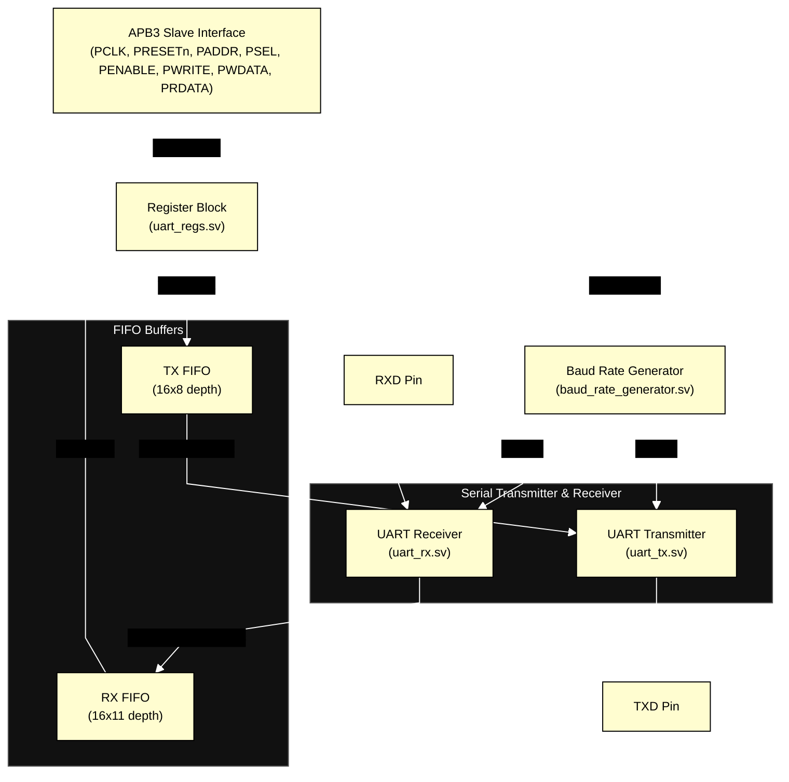

### Reference Diagrams

*   **16x Oversampling & Sampling at Middle**
    The receiver starts on the falling edge of `RXD`, waits 8 ticks to reach the center of the START bit, and then samples data bits every 16 ticks.
    
    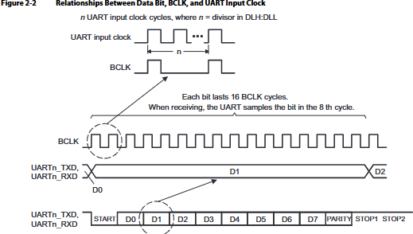

*   **UART Serial Frame Format (8-E-1)**
    Shows the structure of the 11-bit serial packet (1 Start, 8 Data, 1 Even Parity, 1 Stop).
    
    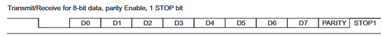

---

## 3. APB3 Bus Specifications
Our design implements a standard **AMBA APB3 Slave**.
*   **Signals Used**:
    *   `PCLK`, `PRESETn`: System clock and active-low reset.
    *   `PADDR`: 5-bit address bus to select registers.
    *   `PSEL`: Select signal to enable the UART peripheral.
    *   `PENABLE`: Strobe signal to indicate the second cycle of a transfer.
    *   `PWRITE`: Direction control (high for write, low for read).
    *   `PWDATA`: 32-bit write data bus (only the lower 8 bits are used).
    *   `PRDATA`: 32-bit read data bus (the upper 24 bits are padded with zeroes).
    *   `PREADY`: Tied to `1'b1` (design has zero wait states).
    *   `PSLVERR`: Tied to `1'b0` (does not generate bus errors).
*   **Bus Transfer Cycles**:
    *   **SETUP cycle**: APB master drives address and control signals, and asserts `PSEL` high.
    *   **ACCESS cycle**: APB master asserts `PENABLE` high. The read/write data is transferred on the rising edge of `PCLK` at the end of this cycle.

### APB Diagrams
*   **APB FSM State Diagram**: Shows the transitions between IDLE, SETUP, and ACCESS.
    
    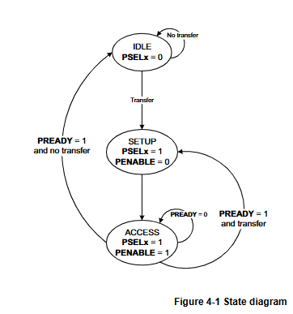

*   **APB Write Timing (No Wait States)**:
    
    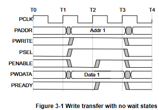

*   **APB Read Timing (No Wait States)**:
    
    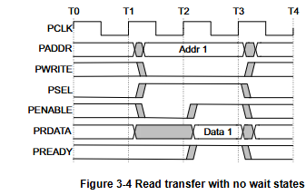

---

## 4. Project Directory Structure
Here are the files in this project. You can click on the names to open them:

| File Name | Description |
| :--- | :--- |
| [apb_uart.sv](file:///e:/projects/VLSI-Projects/UART-Design&Verification/rtl/apb_uart.sv) | Top-level module that connects the APB interface, the registers, and the TX/RX blocks. |
| [uart_regs.sv](file:///e:/projects/VLSI-Projects/UART-Design&Verification/rtl/uart_regs.sv) | Register file containing registers (LCR, LSR, FCR, SCR, DLL, DLH) and the TX/RX FIFOs. |
| [uart_tx.sv](file:///e:/projects/VLSI-Projects/UART-Design&Verification/rtl/uart_tx.sv) | Serial transmitter that converts parallel data from the TX FIFO into serial bits on TXD. |
| [uart_rx.sv](file:///e:/projects/VLSI-Projects/UART-Design&Verification/rtl/uart_rx.sv) | Serial receiver that samples serial bits on RXD and pushes them to the RX FIFO. Includes input synchronizers to avoid metastability. |
| [fifo.sv](file:///e:/projects/VLSI-Projects/UART-Design&Verification/rtl/fifo.sv) | First-Word Fall-Through (FWFT) synchronous FIFO used for buffering. |
| [baud_rate_generator.sv](file:///e:/projects/VLSI-Projects/UART-Design&Verification/rtl/baud_rate_generator.sv) | Divides the system clock to generate the 16x baud clock tick. |
| [tb_top.sv](file:///e:/projects/VLSI-Projects/UART-Design&Verification/tb_sv/tb_top.sv) | Top verification wrapper that sets up clocks, binds assertions, and runs the testbench environment. |
| [apb_interface.sv](file:///e:/projects/VLSI-Projects/UART-Design&Verification/tb_sv/apb_interface.sv) | Interface for the APB signals, including clocking blocks and assertions to check APB protocol. |
| [uart_interface.sv](file:///e:/projects/VLSI-Projects/UART-Design&Verification/tb_sv/uart_interface.sv) | Simple interface wrapper for the serial TXD and RXD lines. |
| [tb_pkg.sv](file:///e:/projects/VLSI-Projects/UART-Design&Verification/tb_sv/tb_pkg.sv) | Package that includes all verification class files. |
| [uart_config.sv](file:///e:/projects/VLSI-Projects/UART-Design&Verification/tb_sv/uart_config.sv) | Configuration class for setting divisor and timing values. |
| [apb_trans.sv](file:///e:/projects/VLSI-Projects/UART-Design&Verification/tb_sv/apb_trans.sv) | Transaction class defining an APB packet (address, data, read/write direction). |
| [generator.sv](file:///e:/projects/VLSI-Projects/UART-Design&Verification/tb_sv/generator.sv) | Generates random test transactions and sends them to the driver. |
| [driver.sv](file:///e:/projects/VLSI-Projects/UART-Design&Verification/tb_sv/driver.sv) | Drives the transaction packet signals onto the physical APB interface. |
| [apb_monitor.sv](file:///e:/projects/VLSI-Projects/UART-Design&Verification/tb_sv/apb_monitor.sv) | Monitors the APB interface signals and converts them to transactions for the scoreboard. |
| [uart_monitor.sv](file:///e:/projects/VLSI-Projects/UART-Design&Verification/tb_sv/uart_monitor.sv) | Monitors the serial line and reconstructs bytes to send to the scoreboard. |
| [scoreboard.sv](file:///e:/projects/VLSI-Projects/UART-Design&Verification/tb_sv/scoreboard.sv) | Compares the transmitted data against received data to verify correct behavior. |
| [env_coverage.sv](file:///e:/projects/VLSI-Projects/UART-Design&Verification/tb_sv/env_coverage.sv) | Tracks functional coverage of configuration register values. |
| [env.sv](file:///e:/projects/VLSI-Projects/UART-Design&Verification/tb_sv/env.sv) | Combines all testbench components (driver, monitor, scoreboard, generator). |
| [uart_tx_sva.sv](file:///e:/projects/VLSI-Projects/UART-Design&Verification/tb_sv/uart_tx_sva.sv) | Assertions to verify the transmitter FSM states and TXD serial outputs. |
| [tb_apb_uart.sv](file:///e:/projects/VLSI-Projects/UART-Design&Verification/tb/tb_apb_uart.sv) | Lightweight loopback testbench for simulation with Icarus Verilog. |
| [tb_baud_rate_generator.sv](file:///e:/projects/VLSI-Projects/UART-Design&Verification/tb/tb_baud_rate_generator.sv) | Standalone testbench for the Baud Rate Generator. |
| [tb_fifo.sv](file:///e:/projects/VLSI-Projects/UART-Design&Verification/tb/tb_fifo.sv) | Standalone testbench for the FIFO. |
| [tb_uart_tx_rx.sv](file:///e:/projects/VLSI-Projects/UART-Design&Verification/tb/tb_uart_tx_rx.sv) | Standalone testbench for the UART transmitter and receiver engines. |

---

## 5. How to Run Simulation
### A. Run Locally (using Icarus Verilog)
To run the lightweight loopback testbench on your computer, run:
```bash
iverilog -g2012 -o apb_uart_tb.vvp rtl/baud_rate_generator.sv rtl/fifo.sv rtl/uart_tx.sv rtl/uart_rx.sv rtl/uart_regs.sv rtl/apb_uart.sv tb/tb_apb_uart.sv
vvp apb_uart_tb.vvp
```

### B. Run SystemVerilog Testbench (on EDA Playground)
1.  Open the project at [EDA Playground](https://www.edaplayground.com/x/rFbW).
2.  Set the simulator settings:
    *   **Simulator**: *Aldec Riviera-PRO*
    *   **Compile Options**: `-sysverilog`
    *   **Run Options**: Enable *EPWave* to view waveforms.
3.  Click **Run** to execute the tests.

---

## 6. Simulation Results & Waveforms
### Test Logs
Test log from the SystemVerilog testbench on EDA Playground:
```text
# KERNEL: [TB TOP] Randomized Config: Divisor=6, WordLength=8, ParityEnable=1, EvenParity=1, StopBits=1
# KERNEL: [TB TOP] Starting randomized loopback test run...
# KERNEL: [Env] Test run completed. Matches=60, Errors=0
# KERNEL: [TB TOP] Test Finished.
```

Test log from the lightweight Icarus Verilog testbench:
```text
Starting APB UART Testbench...
PASS: Scratchpad
PASS: Loopback
PASS: Bulk loopback
APB UART Test Done.
```

### Waveforms
Below are the simulation waveforms from the tests:

1.  **Baud Rate Generator Output**
    Shows the divisor counting and the clock enable tick (`bclk_en`) pulse:
    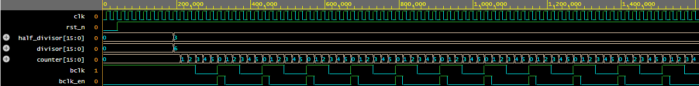

2.  **Transmitter (TX) Serial Output**
    Shows the serialization of data to the `TXD` pin with 8-E-1 formatting:
    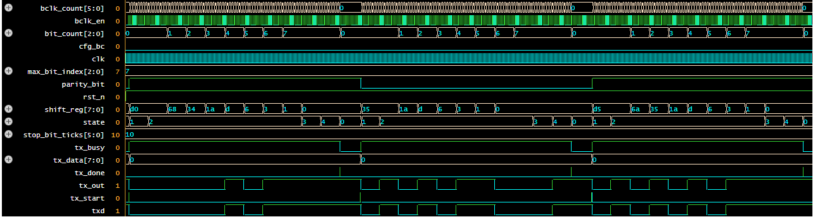

3.  **TX FIFO Status**
    Shows data being written to, held in, and read from the transmit FIFO:
    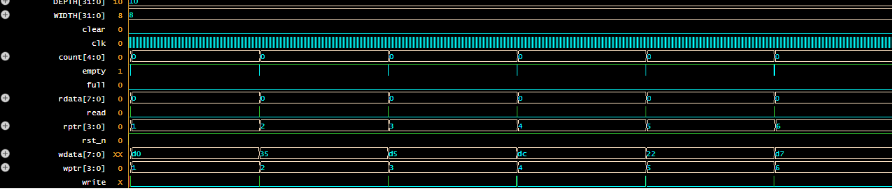

4.  **Receiver (RX) Serial Input**
    Shows the receiver synchronizing the `RXD` pin, finding the start bit falling edge, and sampling in the middle of each bit:
    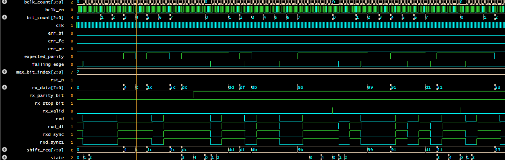

5.  **RX FIFO Status**
    Shows the received byte and error flags being stored and read over the APB bus:
    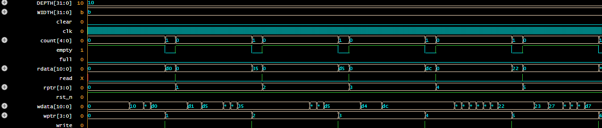
