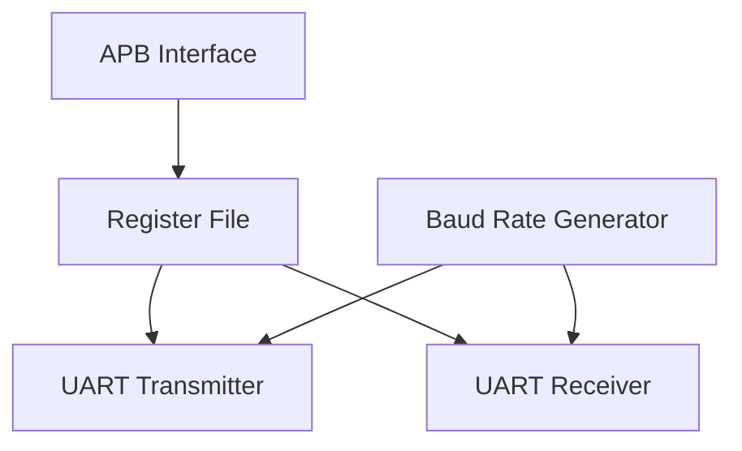

# APB UART Design & Verification

Synthesizable SystemVerilog UART core based on the TI KeyStone UART specifications, wrapped in an AMBA APB interface.

## System Architecture



### Module Specifications
*   `baud_rate_generator.sv`: Generates a toggling `bclk` and single-cycle `bclk_en` running at 16x the baud rate using a 16-bit divisor.
*   `fifo.sv`: Parameterized synchronous FIFO with First-Word Fall-Through (FWFT) read semantics for zero-wait-state register access.
*   `uart_tx.sv`: Serializes 5-8 bit data, calculates parity (odd/even), and generates configurable stop bits (1, 1.5, or 2). Includes break control.
*   `uart_rx.sv`: Synchronizes RXD using a 2-stage synchronizer, detects start bits, samples bits at the 8th BCLK tick, and reports parity, framing, and break errors.

## Simulation & Verification

The project includes both a lightweight, direct testbench suite (compatible with open-source tools like Icarus Verilog) and a full SystemVerilog OOP environment with Assertions (SVA) and functional coverage (compatible with Riviera-Pro, VCS, or Questa).

### 1. Local Verification (Icarus Verilog)

You can run the direct regression tests locally using the following commands:

*   **Baud Rate Generator Test:**
    ```bash
    iverilog -g2012 -o sim_brg.vvp rtl/baud_rate_generator.sv tb/tb_baud_rate_generator.sv
    vvp sim_brg.vvp
    ```
*   **Synchronous FIFO Test:**
    ```bash
    iverilog -g2012 -o sim_fifo.vvp rtl/fifo.sv tb/tb_fifo.sv
    vvp sim_fifo.vvp
    ```
*   **UART Serial Core Test:**
    ```bash
    iverilog -g2012 -o sim_tx_rx.vvp rtl/baud_rate_generator.sv rtl/uart_tx.sv rtl/uart_rx.sv tb/tb_uart_tx_rx.sv
    vvp sim_tx_rx.vvp
    ```
*   **Top-level APB UART Loopback Test:**
    ```bash
    iverilog -g2012 -o sim_apb_uart.vvp rtl/baud_rate_generator.sv rtl/fifo.sv rtl/uart_tx.sv rtl/uart_rx.sv rtl/uart_regs.sv rtl/apb_uart.sv tb/tb_apb_uart.sv
    vvp sim_apb_uart.vvp
    ```

### 2. SystemVerilog OOP Testbench & SVA (EDA Playground)

The verification directory `tb_sv/` contains the modular, class-based verification environment:
*   `apb_interface.sv`: APB bus logic with protocol assertions (Setup phase, Address/Write stability checks).
*   `uart_interface.sv`: Serial TXD/RXD logic with line status assertions.
*   `tb_pkg.sv`: Groups transaction generators, drivers, monitors, and the scoreboard.
*   `tb_top.sv`: The top-level testbench wrapper.

#### Run on EDA Playground
You can run this full OOP suite online:

1.  Open the project on [EDA Playground](https://www.edaplayground.com).
2.  Set the Simulator to **Aldec Riviera-PRO** or **Synopsys VCS**.
3.  Check **"Use Run Script"** (for Riviera-Pro) or set the top entity to `tb_top`.
4.  Click **Run**.

*(Optional: Add your EDA Playground share link below to allow recruiters to run your simulation with one click)*

```text
[Env] Test run completed. Matches=60, Errors=0
[TB TOP] Test Finished.
```
