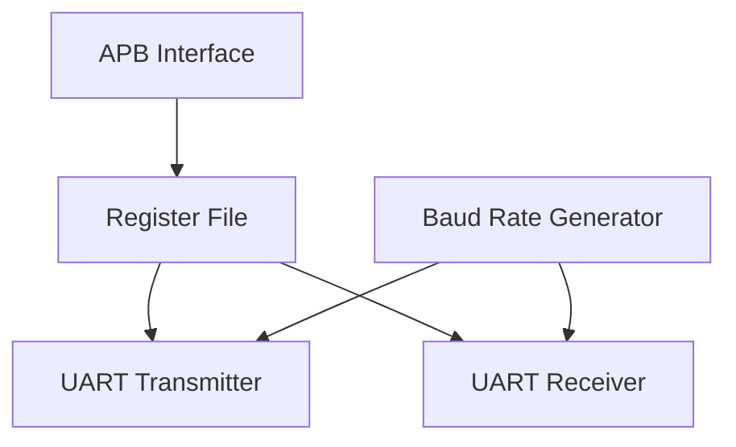

# APB UART Design & Verification

Synthesizable SystemVerilog UART core based on the TI KeyStone UART specifications, wrapped in an AMBA APB interface.

## System Architecture



### Module Specifications
*   `baud_rate_generator.sv`: Generates a toggling `bclk` and single-cycle `bclk_en` running at 16x the baud rate using a 16-bit divisor.
*   `fifo.sv`: Parameterized synchronous FIFO with First-Word Fall-Through (FWFT) read semantics for zero-wait-state register access.
*   `uart_tx.sv`: Serializes 5-8 bit data, calculates parity (odd/even), and generates configurable stop bits (1, 1.5, or 2). Includes break control.
*   `uart_rx.sv`: Synchronizes RXD using a 2-stage synchronizer, detects start bits, samples bits at the 8th BCLK tick, and reports parity, framing, and break errors.

## Simulation & Verification

The project is verified using Icarus Verilog.

### Run Transmitter & Receiver Tests
```bash
iverilog -g2012 -o sim_tx_rx.vvp rtl/baud_rate_generator.sv rtl/uart_tx.sv rtl/uart_rx.sv tb/tb_uart_tx_rx.sv
vvp sim_tx_rx.vvp
```
